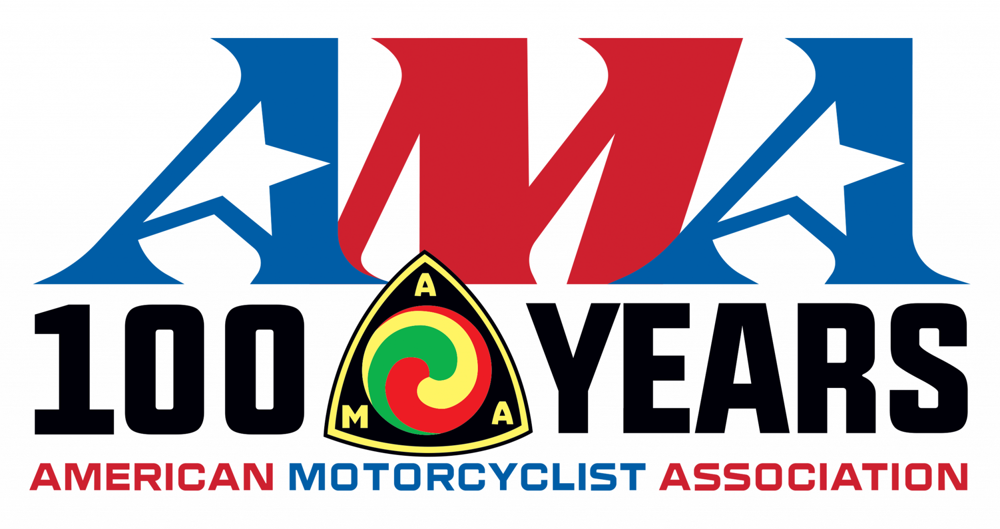

# remotion-starter-t

[Remotion](https://www.remotion.dev/) project - starter T



> Make Videos Programmatically

## Prerequisites

```yaml
node.js: 18.17.1

# npm i -g pnpm
pnpm: 9.12.3
```

Copy `.env.example` to `.env` file:

```yaml
COMPARE=x
```

## Getting Started

```bash
$ pnpm install

# remotion studio
$ pnpm start
```

Try on http://localhost:3000/
